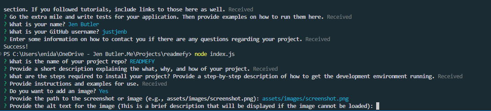

# READMEFY

## Description

READMEFY automates the process of creating a professional README file for GitHub projects. By asking a series of questions using the Inquirer package, it gathers all the necessary information including descriptions, installation instructions, usage details, licenses, and contact information. The script even allows for the inclusion of multiple images, enhancing the visual appeal and clarity of the README. 

## Table of Contents

- [Installation](#installation)
- [Usage](#usage)
- [License](#license)
- [Credits](#credits)
- [Tests](#tests)
- [Contact](#contact)

## Installation

1. Ensure Node.js and npm are installed.
2. Install the project dependencies (inquirer, fs).
3. Clone this repository git@github.com:justjenb/readmefy.git.
4. Navigate to the directory containing index.js.
5. Run the script using node index.js from the terminal.
6. Answer the prompts.
7. Check the generated README file for accuracy and any other edits.

## Usage

1. Answer all questions.
2. Review the README.md file generated.

## License

**This project is licensed under the [MIT](https://opensource.org/licenses/MIT) license.**

For more information about this license, please visit the following link:

https://opensource.org/licenses/MIT

## Credits

Tech references:

https://stackoverflow.com/questions/59078788/how-do-i-dynamically-add-questions-to-inquirer-js-during-execution-using-rxjs

https://pakstech.com/blog/inquirer-js/

https://github.com/SBoudrias/Inquirer.js/

https://www.tabnine.com/code/javascript/functions/builtins/Array/find

https://www.tabnine.com/code/javascript/query/node-fetch%40%40fetch%2Bbuiltins%40Array%40find

https://stackoverflow.com/questions/56412516/conditional-prompt-rendering-in-inquirer

https://github.com/SBoudrias/Inquirer.js/blob/master/packages/inquirer/examples/when.js

## Tests

No tests.

## Contact

My name is Jen Butler.

Here is a link to my [GitHub](https://github.com/justjenb) profile. 

Additional contact details:

You can email me at jen@jenbutler.me
